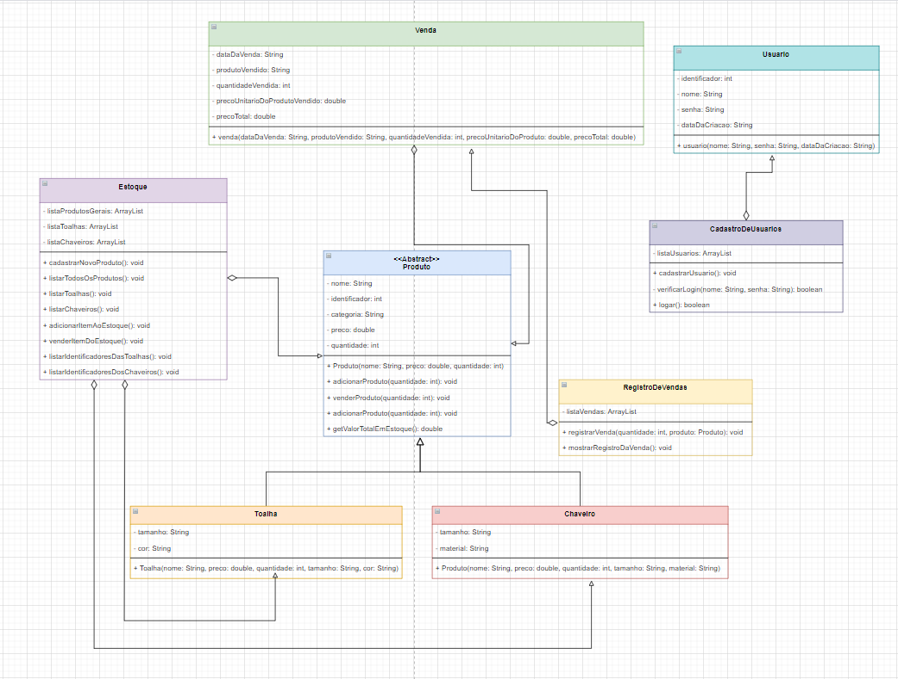

# Definição da Proposta


   Solange é uma artesã que desenvolve trabalhos manuais em pedraria. O problema é que Solange - assim como muitos outros artesãos ou comerciantes - não tem um controle de estoque dos seus produtos, nem um sistema que registra as vendas realizadas, para que ela possa manter um controle de seus itens e do seu caixa financeiro. Atualmente, o registro das vendas realizadas por Solange é feito em um caderno de papel e a verificação do estoque é feita “dando uma olhada" em todos os produtos existentes, para saber se há ou não mercadoria disponível quando um cliente solicita determinado item. De fato, esse sistema adotado por Solange não é prático.

   O projeto foi desenvolvido pensando neste cenário de Solange e de tantos outros comerciantes. Na aplicação, Solange deverá poder cadastrar-se e efetuar o seu login no sistema, cadastrar os seus produtos, verificar o estoque geral de mercadorias, bem como o estoque específico de determinada categoria de produtos. Deverá poder também adicionar novos itens aos produtos já criados, registrar suas vendas realizadas, bem como acessar um registro com todas essas vendas, datadas inclusive.  

   Para criar essa aplicação, foram projetadas oito classes diferentes: 

* **Estoque:** O estoque será identificado com três listas, sendo uma de produtos gerais e outras duas de produtos de categorias específicas;
* **Produto:** Um produto não poderá ser instanciado e será identificado com um nome, um identificador único, uma categoria, um preço e uma quantidade;
* **Toalha (subclasse de Produto):** A toalha é uma subclasse de produto e, além dos atributos deste, terá também um tamanho e uma cor;
* **Chaveiro (subclasse de Produto):** O chaveiro, assim como a toalha, é uma subclasse de produto e, além dos atributos deste, terá também um tamanho e o tipo de material que é feito;
* **Venda:** A venda será identificada com a data em que foi realizada, o nome do produto que foi vendido, a quantidade vendida, o preço unitário da mercadoria e o preço total obtido com a venda;
* **RegistroDeVendas:** O registro de vendas conterá uma lista com as todas as vendas realizadas e deverá fazer um cálculo da somatória dessas vendas;
* **Usuario:** O Usuário será identificado por um nome, uma senha e um identificado único.
* **CadastroDeUsuarios:** O cadastro de usuários conterá uma relação de todos os usuários existentes no sistema e será responsável pelo login e pelo cadastro do usuário.

```
    Abaixo encontra-se a apresentação do diagrama de classes com a descrição dos atributos e métodos do sistema, utilizado para o desenvolvimento do sistema. 
```


